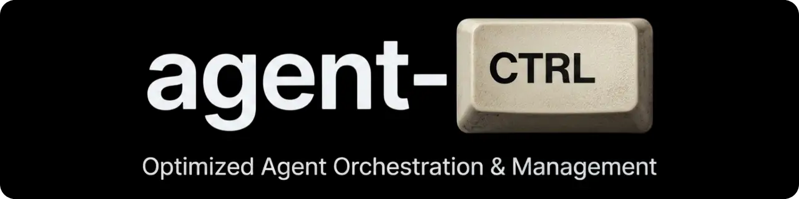

# agent-ctrl

[](./LICENSE)
[](https://github.com/ahmet-cetinkaya/agent-ctrl/stargazers)

A centralized CLI tool for managing AI agent configurations using a **standard directory-based configuration pattern**. Define agent behavior through rules, skills, agents, commands, and MCP servers in a structured, shareable way that works across multiple AI platforms.

**Supported platforms:**


**Status:** 🚧 Early Development phase.

**Core Techs:** [](https://bun.sh)
[](https://www.typescriptlang.org)

---

## 🚀 Quick Start

### Installation

```bash
# Install from npm (global)
npm install -g agent-ctrl-cli

# Run CLI
agent-ctrl --help
```

### Basic Usage

```bash
# 1. Initialize the global configuration structure (default: ~/.agent-ctrl)
agent-ctrl init

# 2. Search and add a skill from SkillsMP marketplace
agent-ctrl skill search code-review
agent-ctrl skill add skillsmp:code-review

# 3. Apply your configuration to a supported platform
agent-ctrl apply claude
```

---

## 🛠 Usage & Commands

`agent-ctrl` provides a comprehensive suite of commands to manage your AI agent's artifacts.

### Global Configuration

- `init [path]` - Initialize the global configuration structure (default: `~/.agent-ctrl`).
- `apply <platform>` - Sync local artifacts to a platform's native configuration.

### Artifact Management

#### Rules (`rules/`)

Modular behavioral guidelines in Markdown.

- `agent-ctrl rule ls` - List all rules.

#### Skills (`skills/`)

Capabilities following the `SKILL.md` standard.

- `agent-ctrl skill ls` - List installed skills.
- `agent-ctrl skill add <id>` - Install a skill (supports `skillsmp:<id>`).
- `agent-ctrl skill search <query>` - Search for skills on SkillsMP.
- `agent-ctrl skill sync` - Synchronize skills catalog.
- `agent-ctrl skill update <id>` - Update an installed skill.
- `agent-ctrl skill rm <id>` - Remove a skill.

#### Commands (`commands/`)

Grouped command prompts or scripts.

- `agent-ctrl command ls` - List available commands.

#### Agents (`agents/`)

Agent personas and identity definitions.

- `agent-ctrl agent ls` - List agent personas.

#### MCP Configuration (`mcps/`)

- `agent-ctrl mcp ls` - List configured MCP servers.
- `agent-ctrl mcp add <id>` - Add an MCP server (supports `smithery:<id>`).
- `agent-ctrl mcp search <query>` - Search for MCP servers on Smithery.
- `agent-ctrl mcp sync` - Synchronize MCP servers catalog.
- `agent-ctrl mcp update <id>` - Update a configured MCP server.
- `agent-ctrl mcp rm <id>` - Remove an MCP server.

---

## 📂 Project Structure

`agent-ctrl` enforces a **Convention over Configuration** pattern. The directory structure IS your agent's configuration.

```text
~/.agent-ctrl/              # Global configuration root (default)
├── rules/                  # Modular behavioral rules (Markdown)
│   ├── coding-style.md
│   └── security.md
├── skills/                 # Capabilities (SKILL.md standard)
│   └── git-workflow/
│       └── SKILL.md
├── commands/               # Command prompts (Markdown/Scripts)
│   ├── dev/
│   │   └── fix-lint.md
│   └── explain.md
├── agents/                 # Agent personas
│   └── architect.md
├── mcps/                   # MCP server configurations
│   └── filesystem/
│       └── MCP.json
└── .env                    # Optional API credentials for catalog access
```

**Note:** You can also use project-scoped configuration by placing `.agent-ctrl/` in your project directory.

---

## 🛠 Development

**Prerequisites:** [Bun](https://bun.sh) (latest LTS), TypeScript 5.0+

```bash
# Clone and install
git clone https://github.com/ahmet-cetinkaya/agent-ctrl.git
cd agent-ctrl
bun install

# Common tasks
bun run dev          # Run in development mode
bun run build        # Build to dist/
bun test             # Run tests
```

For detailed development workflows, see **[Development](./docs/DEVELOPMENT.md)**.

---

## 📚 Documentation

For detailed documentation, see **[docs/README.md](./docs/README.md)**.

---

## 📄 License

This project is licensed under the **GNU General Public License v3.0** - see the [LICENSE](LICENSE) file for details.
